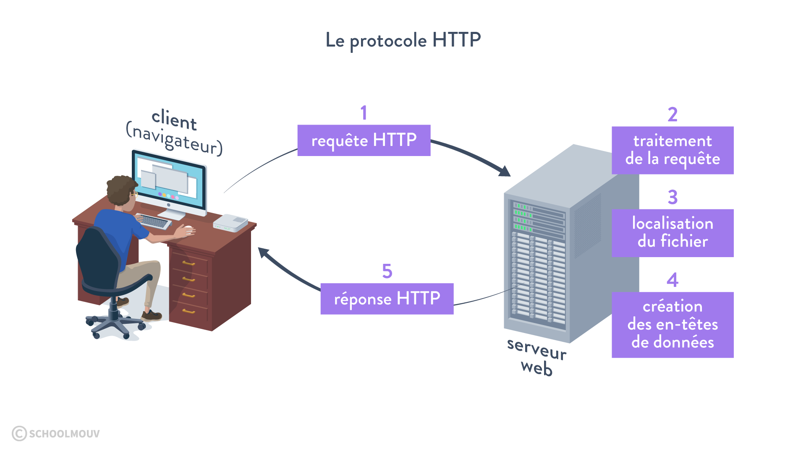
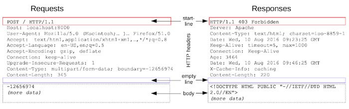

# Chapitre 1 : les bases du web et HTTP 

## HTTP 

HTTP est un acronyme pour `Hyper Text Transfer Protocol`. 

HTTP est un protocole d'échange d'informations sur internet:
* ce protocole est sans état (stateless) : les requêtes sont
indépendantes
* c'est dans les réponses HTTP que peut se trouver le HTML
* il s'agit d'un protocole textuel (jusqu'à HTTP 2 en tous cas)
* il peut être chiffré pour éviter les modifications et "l'espionnage" par des tiers (le HTTPS)

## Parcours des requêtes 

Un *client* va faire une *requête HTTP* et un *serveur* va lui répondre une *réponse HTTP*. 

Source: [https://explorweb.github.io/cours2018/cours/commande_HTTP_Postman.html]

## Exemple de requête 

Nous allons nous focaliser sur HTTP en version 1. Dans cette version, les requêtes et réponses sont *uniquement* des échanges sous forme de texte. 

Source: [https://www.pierre-giraud.com/http-reseau-securite-cours/requête-reponse-session/]

HTTP étant un protocole, il est extrêmement normé : il n'y a pas de place au hasard. Il doit également être très flexible pour permettre tout type d'échanges. 

Globalement toutes les requêtes HTTP sont constituées des éléments suivants : 
* une ligne de départ 
* un ensemble de HEADER 
* un contenu  

### La ligne de départ 

Pour la requête, c'est elle qui va décrire : 
* le verbe HTTP 
* la ressource demandée 
* la version du protocole a utiliser 

Pour la réponse :
* la version du protocole 
* un code permettant de déterminer si la requête est en succès ou en échec (en donnant une indication de pourquoi) 

## Les verbes HTTP 

La partie la plus important de la requête est probablement le verbe. Il s'agit d'indiquer au serveur s'il doit créer, modifier ou simplement accéder à une ressource. 

Voici une partie des verbes les plus utiles : 
* `GET` permet de demander une ressource sans la modifier 
* `POST` permet de transmettre des données dans le but de manipuler une ressource 
* `PUT` permet de remplacer ou d'ajouter une ressource sur le serveur 
* `PATCH` permet de modifier partiellement une ressource 
* `DELETE` permet de supprimer une ressource du serveur 

Si cela vous fait penser aux `CRUD` (create / read / update / delete) des bases de données : c'est normal. Il s'agit de moyens efficaces de décrire des manipulations de données dans les deux cas.  

## Les codes de retour HTTP 
Si vous avez déjà entendu les mots suivants : 
* erreur 404 (ressource non trouvée)
* erreurs 500 (erreur du serveur)

Ils viennent des code de réponse HTTP, qui sont regroupés par centaine : 
* entre 200 et 299 : tout s'est bien passé 
* entre 300 et 399 : erreur d'autorisation / authentification 
* entre 400 et 499 : erreur du côté du client (il a demandé une ressource non trouvée par exemple)
* entre 500 et 599 : erreur du côté du serveur (la requête à fait crasher le serveur)

Pour plus de détails, voilà une bonne ressource : https://developer.mozilla.org/en-US/docs/Web/HTTP/Status 

## Intérêt des framework webs 

Lorsque nous "codons un site web", nous avons besoin de coder des fonctions qui en fonction des paramètres de la requête vont construire une réponse spécifique. 

Pour cela, il faut manipuler le HTTP pour comprendre ce qui est réellement demandé par le client, puis ré-encapsuler la réponse avec les bons paramètres. 

Il est tout à fait possible de faire cela à la main, mais ce n'est pas très pratique. Il faudrait tout recoder, chacun dans son coin. C'est pour cela que les frameworks web sont nés. 

Globalement, on peut les imaginer comme des outils permettant de nous abstraire du HTTP. Nous allons les configurer pour appeler certaines fonctions selon les requêtes web qu'ils rencontrent. Le framework va gérer tout le reste (parsing des paramètres, validation, gestion des erreurs) sans que nous ayons (trop) à nous en soucier. 

## En pratique dans ce cours 

Nous allons développer des API webs, il s'agit de contenus destinés à être manipuler par des machines. 

Nos requêtes HTTP, auront donc des verbes et potentiellement des headers, mais les réponses contiendront principalement du JSON (et non pas du HTML). 