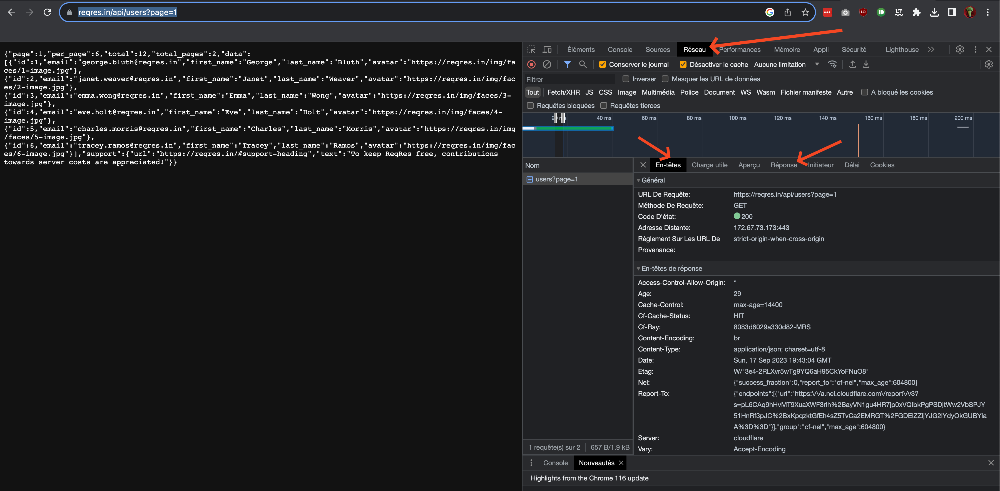
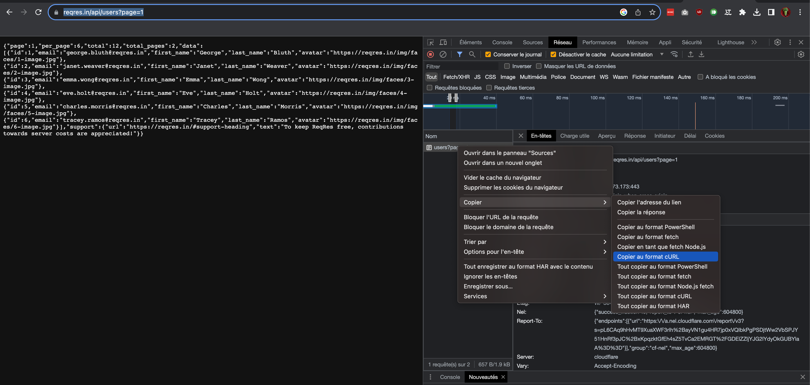
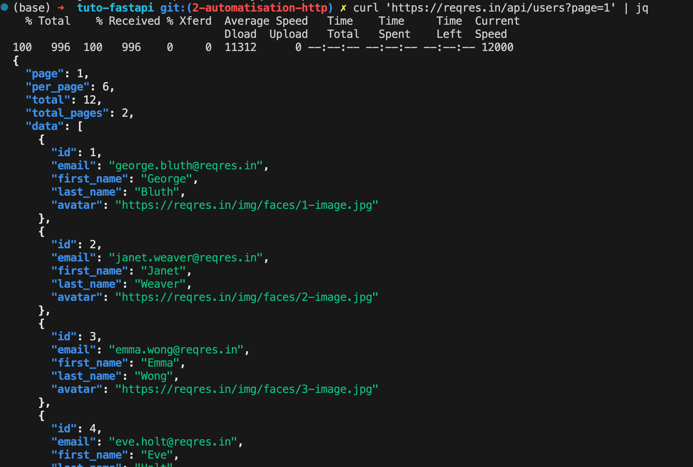

# Chapitre 2 : automatiser des requêtes HTTP 

## Les outils 

Quelque soit votre appareil ou système d'exploitation, vous possédez déjà au moins un outils pour effectuer des requêtes HTTP : votre navigateur internet. 

Vous pouvez les voir en ouvrant les "Outils de développement". Voici un exemple en me connectant au site avec Chrome sous Mac : https://reqres.in/api/users?page=1 

Suivez les flèches pour voir le bon onglet puis la requête ou la réponse. 

Le navigateur est un outil intéressant pour analyser du HTTP (il est globalement fait pour). Cependant, il n'est pas prévu pour automatiser des requêtes HTTP. 

Pour cela, nous pouvons utiliser, en ligne de commande : 
* curl / wget 
* n'importe quel language de programmation (nous allons regarder avec python)

## Curl 

Pour tester curl, vous devez ouvrir une ligne de commande et taper `curl`. S'il n'est pas installé, regardez comment faire pour votre OS (sous windows installez `git bash`).

Globalement la syntaxe de curl est assez simple : `curl [OPTIONS] URL`. L'outils sortira le résultat dans la console par défaut. 

Essayez : `curl 'https://reqres.in/api/users?page=1'` 

Pour changer de verbe HTTP et passer des options :  
* nous allons récupérer l'utilisateur 2 : 
    * `curl 'https://reqres.in/api/users/2'` 
    * La réponse est : `{"data":{"id":2,"email":"janet.weaver@reqres.in","first_name":"Janet","last_name":"Weaver","avatar":"https://reqres.in/img/faces/2-image.jpg"},"support":{"url":"https://reqres.in/#support-heading","text":"To keep ReqRes free, contributions towards server costs are appreciated!"}}`
* nous allons créer un utilisateur `John Doe` qui est chercheur dans l'api (verbe HTTP POST): `
    * `curl -X POST -d '{"name": "John Doe","job": "Researcher"}' 'https://reqres.in/api/users'`. 
    * La réponse est la suivante : `{{"name": "John Doe","job": "Researcher"}":"","id":"516","createdAt":"2023-09-17T20:21:24.248Z"}` l'utilisateur est créé sous l'id `516`
* nous allons mettre à jour l'utilisateur 2023 (requete HTTP PUT) : 
  * `curl -X PUT -d '{"first_name": "Matthieu"}' 'https://reqres.in/api/users/2023'`
  * et la réponse : `{"{"first_name": "Matthieu"}":"","updatedAt":"2023-09-17T20:30:28.992Z"}`

Protip : depuis chrome / firefox vous pouvez copier n'importe quelle requête effectuée par le navigateur sous format `curl`. 

Protip 2 : il est possible (et c'est couramment le cas) d'utiliser  `jq` pour analyser les résultat d'une API json directement depuis la ligne de commande 

Testez la requêtes suivante pour comprendre l'intérêt de l'outil : `curl 'https://reqres.in/api/users?page=1' | jq ".data[].email"`

## Python 

En python nous pouvons utiliser la bibliothèque tierce `requests` pour faire facilement des requêtes HTTP. Il existe des bibliothèques fournies de base avec le language, mais `requests` est plus simple pour commencer (globalement tout le monde l'utilise pour ça). 

Pour l'installer : `pip install requests` 

L'api de la bibliothèque est assez simple : 
* `requests.get`, `requests.post`, `request.delete`... vous permet de choisir le verbe 
* si vous voulez passer des paramètres ajoutez : `json={"mes datas": "sous forme de dictionnaire"}` lors de l'appel, la bibliothèque fera les conversions automatiquement
* vous allez obtenir un objet `requests.response` qui possède peut se manipuler comme cela : 
    * `response.status_code` pour le code de la réponse 
    * `response.json()` pour avoir le json associé à la réponse 

Vous pouvez trouver un code d'exemple dans le fichier `../codes/exemple_requests.py`. Pour le faire fonctionner, vous devez installer les requirements présent à la racine du projet (`pip install -r requirements.txt`)

## Conclusion

Vous pouvez effectuer des requêtes HTTP aussi bien à travers un navigateur web, qu'en ligne de commande ou en python. Vous comprenez donc mieux la partie "client" du cycle de réponse. 

Dans le prochain chapitre, nous verrons comment créer un serveur HTTP grâce à `fastapi`.